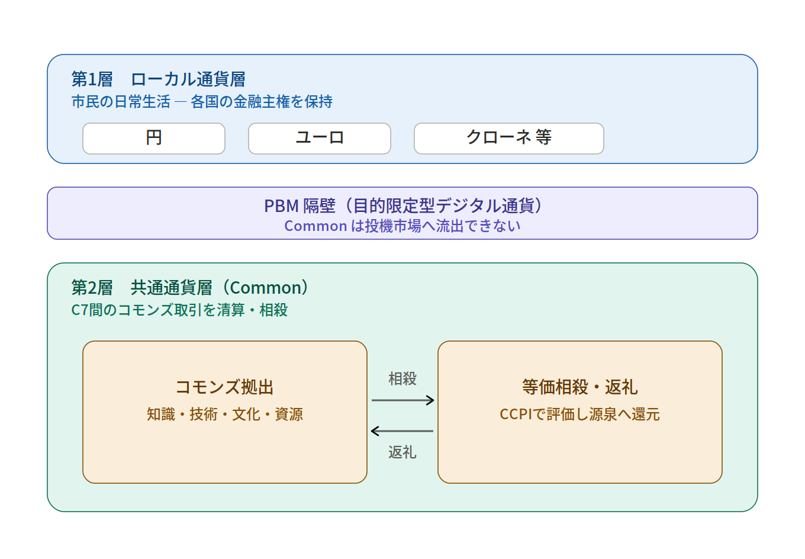
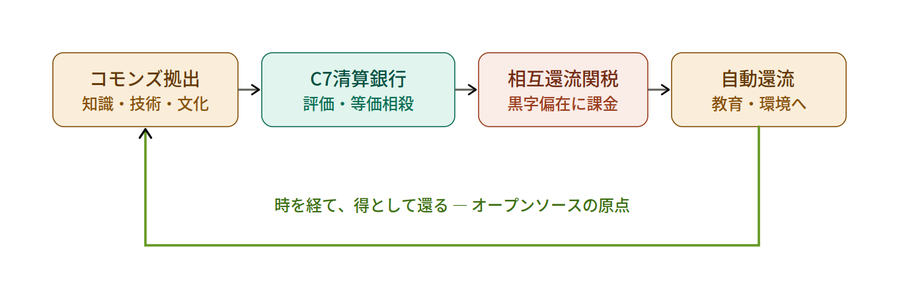

# Digital Commons — コモンズを、どう分かち合うか

[](https://doi.org/10.5281/zenodo.20685859)
[](LICENSE)

> 7つの国の輪から始まる、世界を取りまく和。
> A circle of seven nations, becoming a harmony that wraps the world.

---

## このリポジトリは何か / What this is

ここは論文の保管庫ではありません。**「コモンズ（共有財）を、人類はこれからどう分かち合っていくのか」を語り合い、設計していくための母艦（ハブ）**です。

最初の核となるのは、論文『ポスト資本主義における多国間デジタル・コモンズの構築』（DOI: [10.5281/zenodo.20685859](https://doi.org/10.5281/zenodo.20685859)）。これを創設モジュール（C7）として、知識・技術・文化・自然資源といったコモンズの「返礼のルール」を、立場や国境を越えて一緒に設計していきます。ここから、倫理核となる **TTT（Tri-Tetra Theory）** や、行動への呼びかけ **#LOOKATYOURHANDS** といった構想を結び、育てていく場とします。

This repository is **a hub** for dialogue and design around the commons — not just an archive. Its founding module is the paper *Constructing a Multilateral Digital Commons in Post-Capitalism* (the **C7** model). From here we connect and grow related efforts — the ethical core **TTT (Tri-Tetra Theory)** and the call to action **#LOOKATYOURHANDS** — to design the missing "protocol of giving back" for the knowledge, technology, culture, and natural resources we all share.

## 収録モジュール / Modules

| モジュール | 状態 | 概要 |
|---|---|---|
| **C7** — 多国間デジタル・コモンズ | ✅ 創設・公開済み | 二階層通貨とCommonによる相殺ガバナンス（[論文](docs/paper.md) / [DOI](https://doi.org/10.5281/zenodo.20685859)） |
| **TTT** — Tri-Tetra Theory | 🔜 接続予定 | コモンズ・ガバナンスの倫理核（友朋共生・jJ軸） |
| **#LOOKATYOURHANDS** | 🔜 接続予定 | 「自分の手を見よ」から始まる行動への国際的呼びかけ |

---

## はじめに読む / Start here

- 📄 **論文（日本語・Markdown版）**: [`docs/paper.md`](docs/paper.md)
- 📄 **論文（図入り・Word版）**: [`docs/C7_post-capitalism_digital_commons.docx`](docs/C7_post-capitalism_digital_commons.docx)
- 🔗 **Zenodo（DOI・正本）**: https://doi.org/10.5281/zenodo.20685859
- ❓ **いま議論したい論点**: [`docs/open-questions.md`](docs/open-questions.md)

---

## 中核の仕組み / Core mechanism

二階層通貨システムが、市民の生活通貨とコモンズ取引用の共通通貨「Common」を、PBM隔壁で分離します。



清算銀行が拠出を相殺し、富の偏在を相互還流関税で他国の教育・環境コモンズへ自動的に戻す。この往還の原理が「教えることは徳であり、時を経て得として還る」というオープンソースの原点です。



---

## 参加するには / How to take part

このリポジトリの主役は **Discussions** です。

1. リポジトリ上部の **Discussions** タブを開く（※リポジトリ管理者が Settings → Features で有効化してください）。
2. 関心のあるカテゴリで対話を始める：
   - **💡 Ideas** — コモンズの新しい設計案、CCPIや還流ルールへの提案
   - **🙋 Q&A** — 論文への質問、前提の確認
   - **🌍 Show and tell** — 各地・各分野での実践事例の持ち寄り
   - **🗣 General** — 雑談、哲学、風の時代の話
3. 具体的な修正提案（誤りの指摘、文言、図の改善）は **Issues** または **Pull Request** で。

立場の異なる意見こそ歓迎します。ここでは、反論もまた「持ち寄られたコモンズ」です。

---

## 発展の方向 / Roadmap

このリポジトリは、より大きな構想の入り口でもあります。

- **TTT（Tri-Tetra Theory）** — コモンズ・ガバナンスの倫理核（友朋共生・jJ軸）との接続。
- **#LOOKATYOURHANDS** — 「自分の手を見よ」から始まる、行動への国際的呼びかけとの連携。
- 各国の特異的資産（Specific Commons）の事例カタログ化。

関心のある接続点があれば、Discussions で提案してください。

---

## 引用 / Citation

```
川上 真潔 (Kawakami, Naoyuki). (2026).
ポスト資本主義における多国間デジタル・コモンズの構築：
中堅7カ国（C7）による二階層通貨システムと資源・技術の相殺ガバナンス. Zenodo.
https://doi.org/10.5281/zenodo.20685859
```

詳細は [`CITATION.cff`](CITATION.cff) を参照。

---

## ライセンス / License

本リポジトリの文章・図は **Creative Commons Attribution 4.0 International (CC BY 4.0)** で公開します。出典を明記すれば、誰でも自由に利用・改変・再配布できます。それがコモンズの精神です。

Text and figures in this repository are licensed under **CC BY 4.0**. Share, adapt, and build upon them freely, with attribution.

---

*友朋共生 — Living together as friends and companions.*
